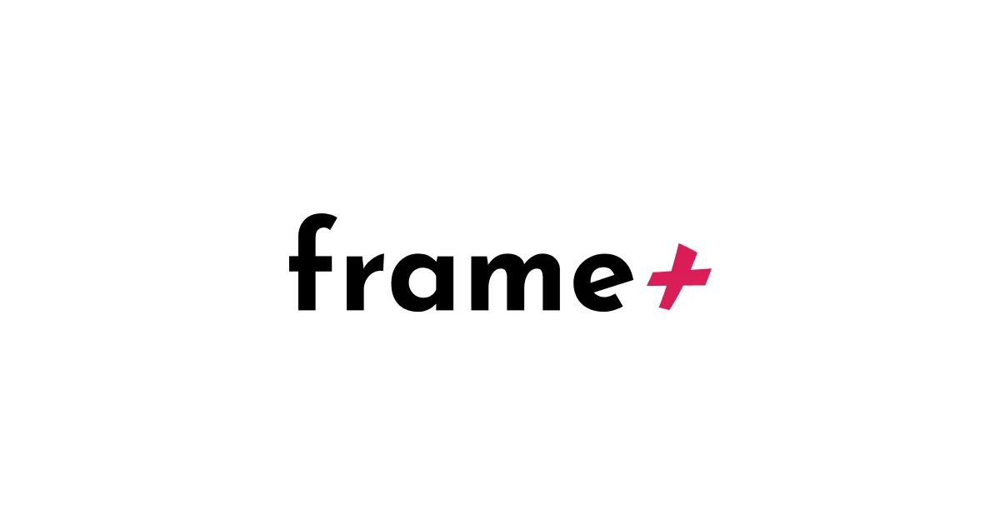

## Summary
Frame Plus is a set of premium components that extend your possibilities in Framer without you needing to write any code.

## Key Details
- **Source:** [frameplus.framer.website](https://frameplus.framer.website/)
- **Title:** Frame+
- **Description:** Frame Plus is a set of premium components that extend your possibilities in Framer without you needing to write any code.

## Visual Assets

