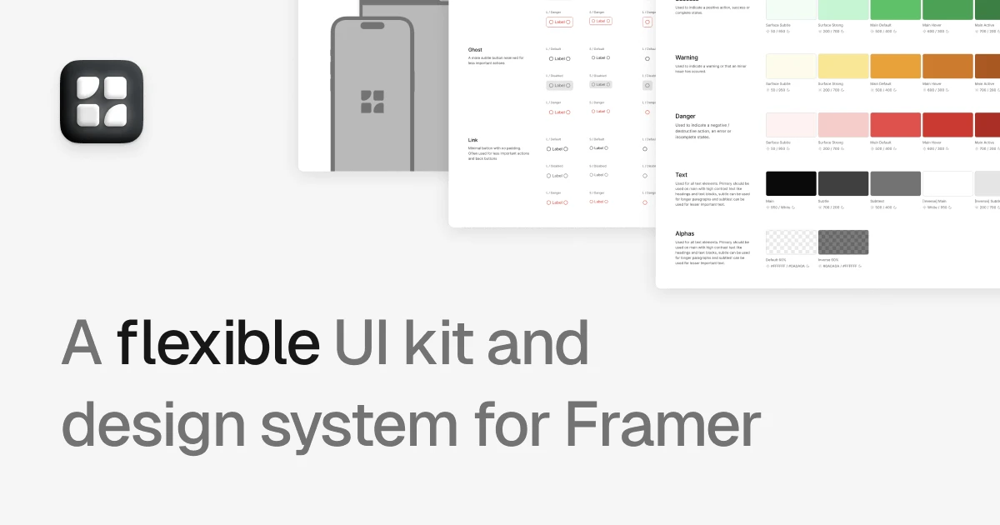

## Summary
Framepad helps you build and ship sites faster with a huge collection of adaptable components and layouts.

## Key Details
- **Source:** [framepad.co](https://www.framepad.co/)
- **Title:** Framepad - Framer UI Kit & Design System
- **Description:** Framepad helps you build and ship sites faster with a huge collection of adaptable components and layouts.

## Visual Assets

