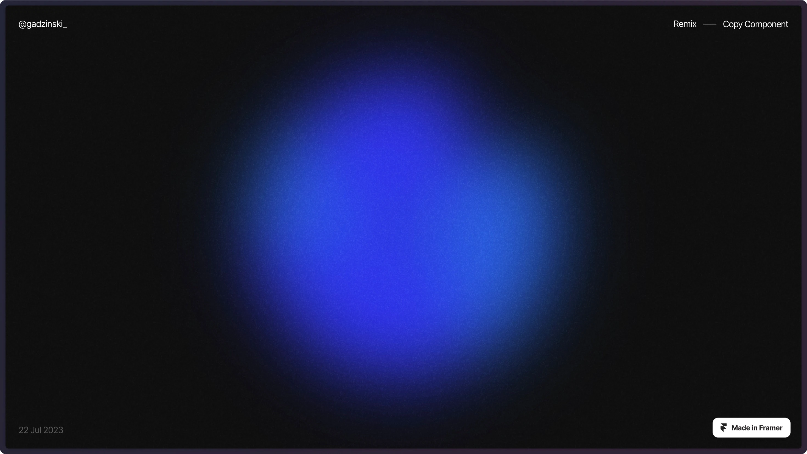

## Summary
The Animated Gradient Glow component, developed by Filip Gadzinski, is a free Framer component, designed to bring enhanced functionality and style to your Framer projects. Whether you

## Key Details
- **Source:** [framer.city](https://framer.city/components/animated-gradient-glow)
- **Title:** Framer City - Animated Gradient Glow - Filip Gadzinski  #1 Framer Resource Site (+600 components) to Remix
- **Description:** The Animated Gradient Glow component, developed by Filip Gadzinski, is a free Framer component, designed to bring enhanced functionality and style to 

## Visual Assets

