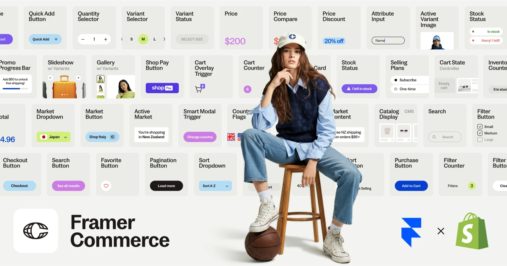

## Summary
Design & launch standout Shopify e-commerce stores on Framer. Awarded Framer Plugin of the Year.

## Key Details
- **Source:** [framercommerce.com](https://framercommerce.com/)
- **Title:** Framer Commerce | Shopify x Framer
- **Description:** Design & launch standout Shopify e-commerce stores on Framer. Awarded Framer Plugin of the Year.

## Visual Assets

