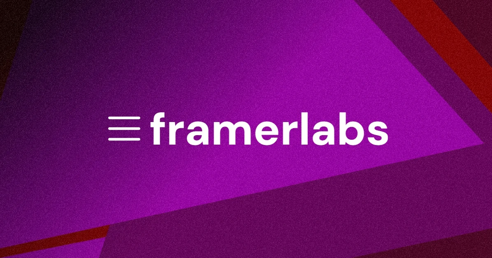

## Summary
Experimenting with Framer native features and custom code.

## Key Details
- **Source:** [labs.framer.wiki](https://labs.framer.wiki/nebula)
- **Title:** Framer labs
- **Description:** Experimenting with Framer native features and custom code.

## Visual Assets

