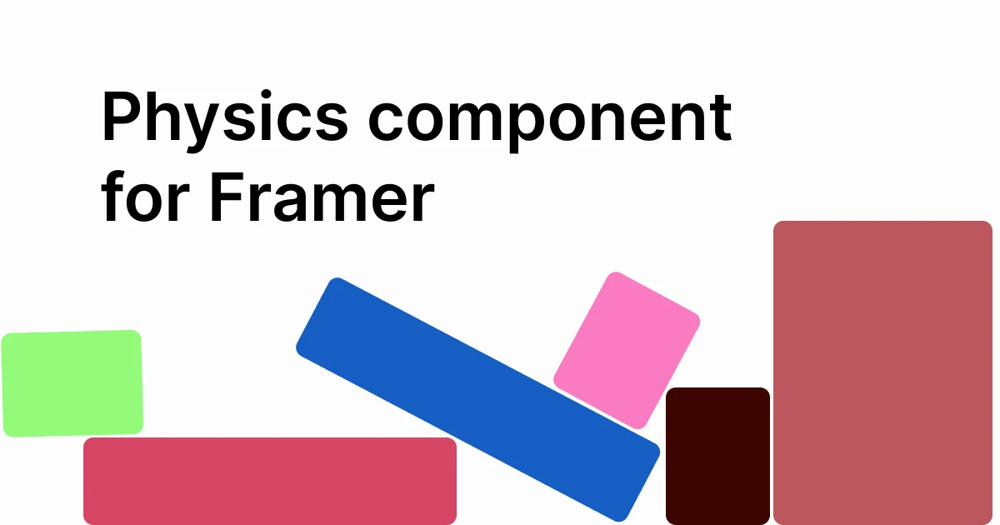

## Summary
A physics component for Framer. Made by @mk_wlsn

## Key Details
- **Source:** [physics.framer.website](https://physics.framer.website/)
- **Title:** Framer - Physics
- **Description:** A physics component for Framer. Made by @mk_wlsn

## Visual Assets

