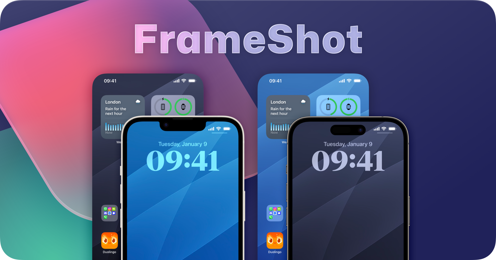

## Summary
A pair of shortcuts to simplify beautifying your iPhone Screenshots. Frameless & Framed Versions with three background options.

## Key Details
- **Source:** [keiransell.com](https://www.keiransell.com/frameshot)
- **Title:** FrameShot
- **Description:** A pair of shortcuts to simplify beautifying your iPhone Screenshots. Frameless & Framed Versions with three background options.

## Visual Assets

