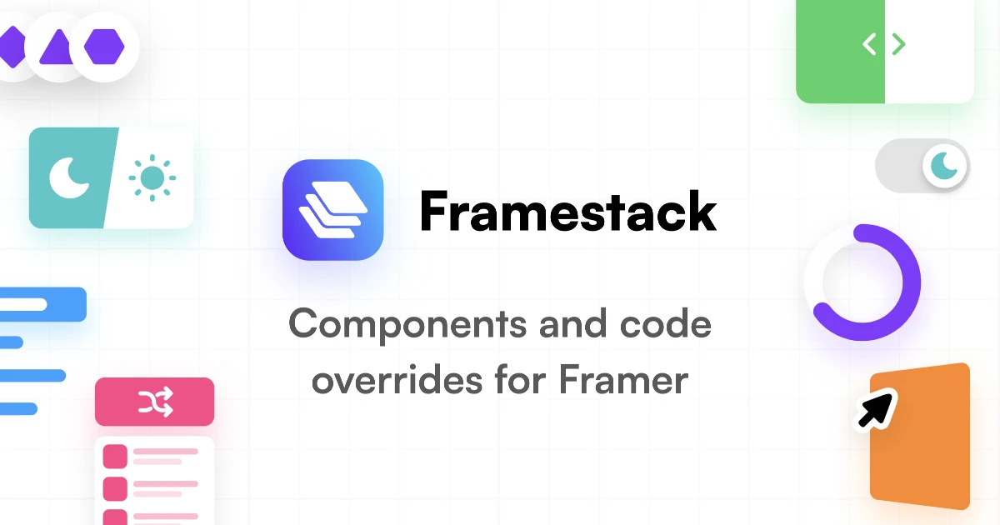

## Summary
The ultimate library of components and code overrides for building websites in Framer.

## Key Details
- **Source:** [framertoolbox.com](https://framertoolbox.com/tools/cms-exporter)
- **Title:** Framestack | Framer Component Library
- **Description:** The ultimate library of components and code overrides for building websites in Framer.

## Visual Assets

