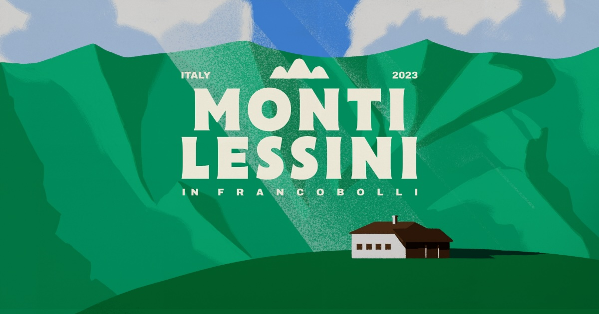

## Summary
"Francobolli per la Lessinia" di Andrea Rubele trasforma i paesaggi del Parco Regionale della Lessinia 
            in illustrazioni ispirate ai poster ENIT anni '40-'50, celebrando l'amore per la mon

## Key Details
- **Source:** [francobollimontilessini.com](https://www.francobollimontilessini.com/discover)
- **Title:** Francobolli per la Lessinia
- **Description:** "Francobolli per la Lessinia" di Andrea Rubele trasforma i paesaggi del Parco Regionale della Lessinia 
            in illustrazioni ispirate ai poste

## Visual Assets

