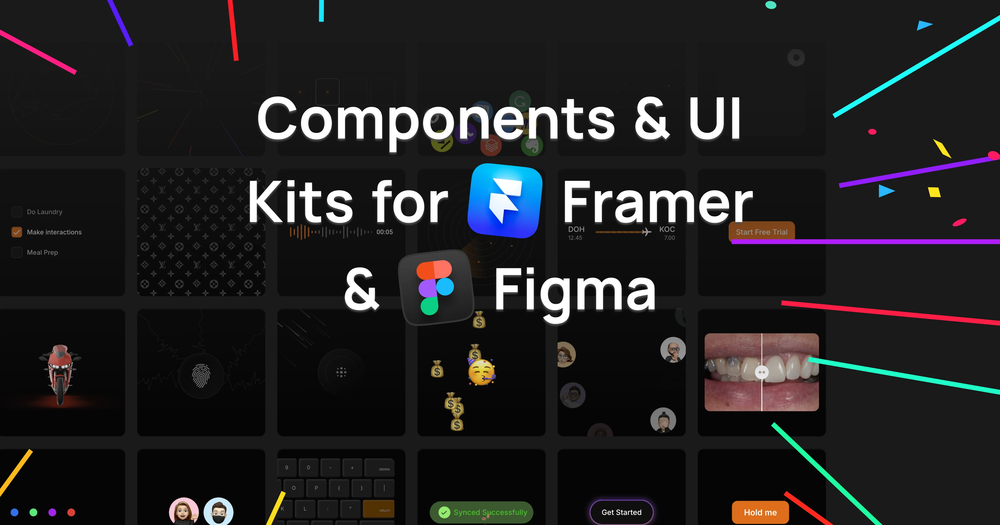

## Summary
SegmentUI is a 360 degree solution for Framer & Figma. The ultimate design resource that covers everything from ideation to monetisation. Free UI Kits, templates, design systems, components and custom

## Key Details
- **Source:** [segmentui.com](https://segmentui.com/uikit/gradient-blur-overlay)
- **Title:** Free Resources, Components & UI Kits for Framer & Figma
- **Description:** SegmentUI is a 360 degree solution for Framer & Figma. The ultimate design resource that covers everything from ideation to monetisation. Free UI Kits

## Visual Assets

