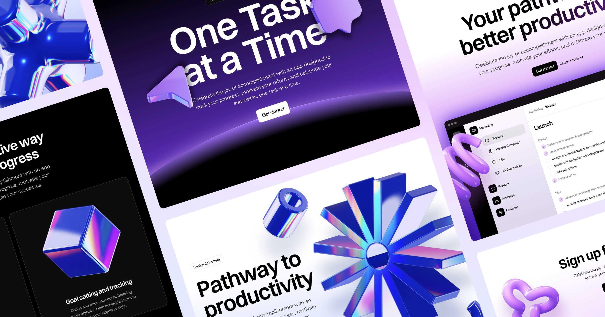

## Summary
Turn your ideas into a fully functional, responsive, no-code SaaS website in just minutes with the set of free components for Framer and Figma.

## Key Details
- **Source:** [framer.com](https://www.framer.com/free-saas-ui-kit/)
- **Title:** Free SaaS Website UI Kit for Framer and Figma
- **Description:** Turn your ideas into a fully functional, responsive, no-code SaaS website in just minutes with the set of free components for Framer and Figma.

## Visual Assets

