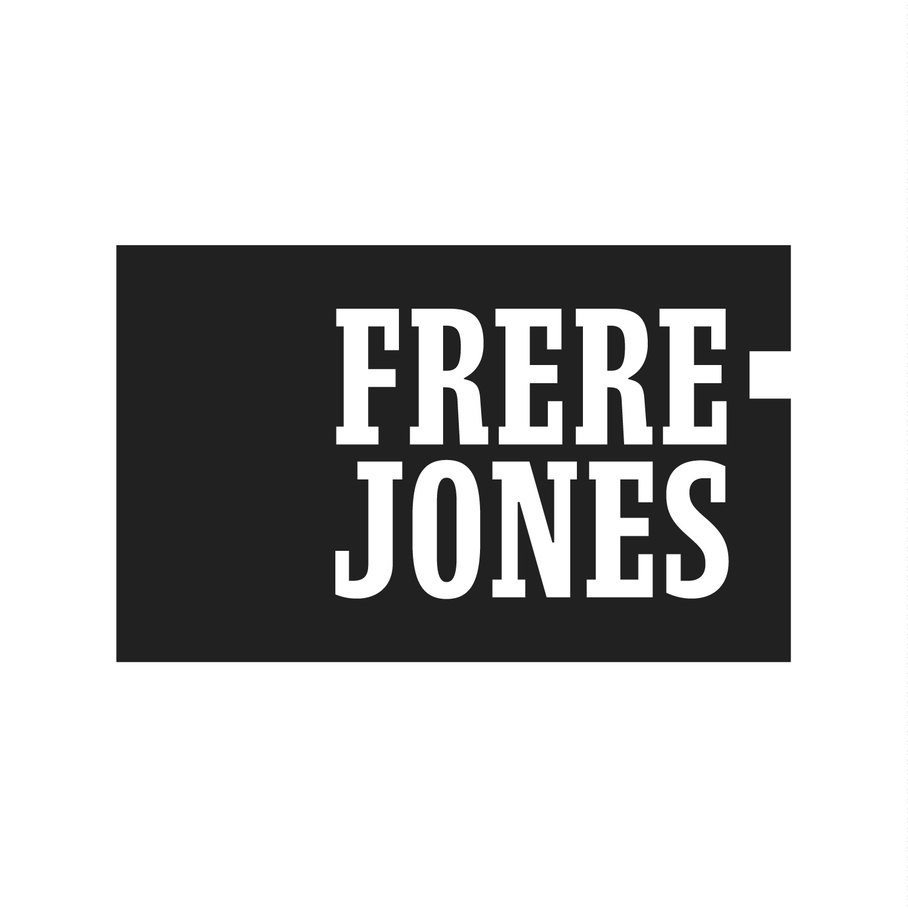

## Summary
Frere-Jones Type is a type design practice in New York City.

## Key Details
- **Source:** [frerejones.com](https://frerejones.com/)
- **Title:** Frere-Jones Type
- **Description:** Frere-Jones Type is a type design practice in New York City.

## Visual Assets

