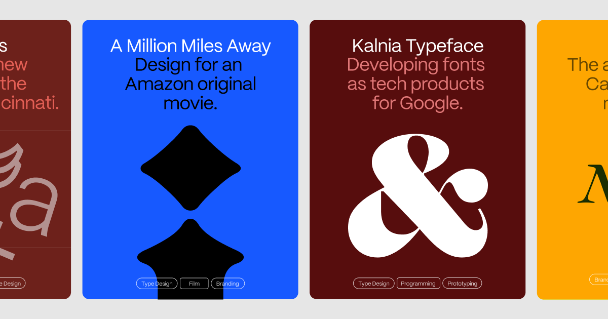

## Summary
Frida Medrano is a Mexican type and product designer based in San Francisco, California, currently working as Art Director at Kettle. In her perspective, Type is the perfect space where code and graph

## Key Details
- **Source:** [fridamedrano.com](https://www.fridamedrano.com/)
- **Title:** Frida Medrano is a Mexican type and product designer based in San Francisco, California, currently working as Art Director at Kettle. In her perspective, Type is the perfect space where code and graphic design converge, shaping her work philosophy and guiding her through the automation process in her projects. She won the 2018 SOTA Catalyst Award and has presented her work in forums like TypeCon, DesignMatters, ATypI, TypeLab, IxDA, Letrástica, and TMX.
- **Description:** Frida Medrano is a Mexican type and product designer based in San Francisco, California, currently working as Art Director at Kettle. In her perspecti

## Visual Assets

