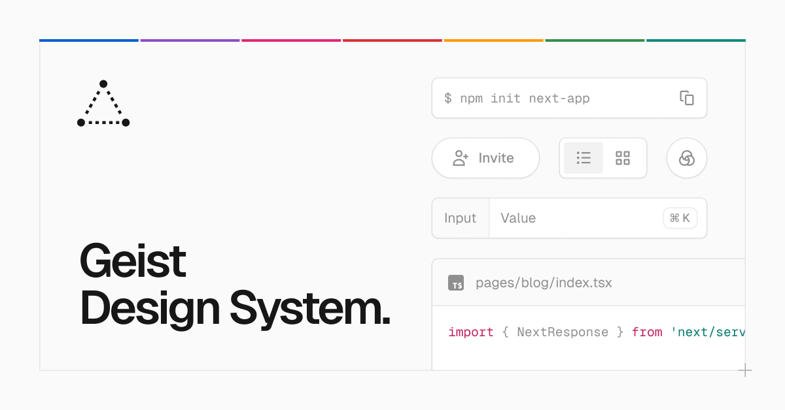

## Summary
Vercel's design system called Geist. Made for building consistent and delightful web experiences.

## Key Details
- **Source:** [vercel.com](https://vercel.com/geist/introduction)
- **Title:** Geist
- **Description:** Vercel's design system called Geist. Made for building consistent and delightful web experiences.

## Visual Assets

