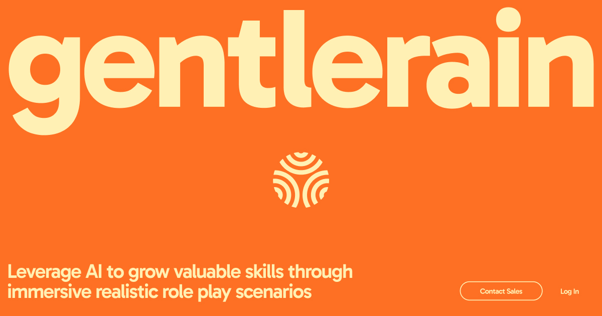

## Summary
Gentlerain is a training solution that leverages generative AI to create immersive realistic role play scenarios that help users in the corporate world growing skills in fields such as leadership, mar

## Key Details
- **Source:** [gentlerain.ai](https://www.gentlerain.ai/)
- **Title:** Gentlerain is a training solution that leverages generative AI to create immersive realistic role play scenarios that help users in the corporate world growing skills in fields such as leadership, marketing or project management.
- **Description:** Gentlerain is a training solution that leverages generative AI to create immersive realistic role play scenarios that help users in the corporate worl

## Visual Assets

