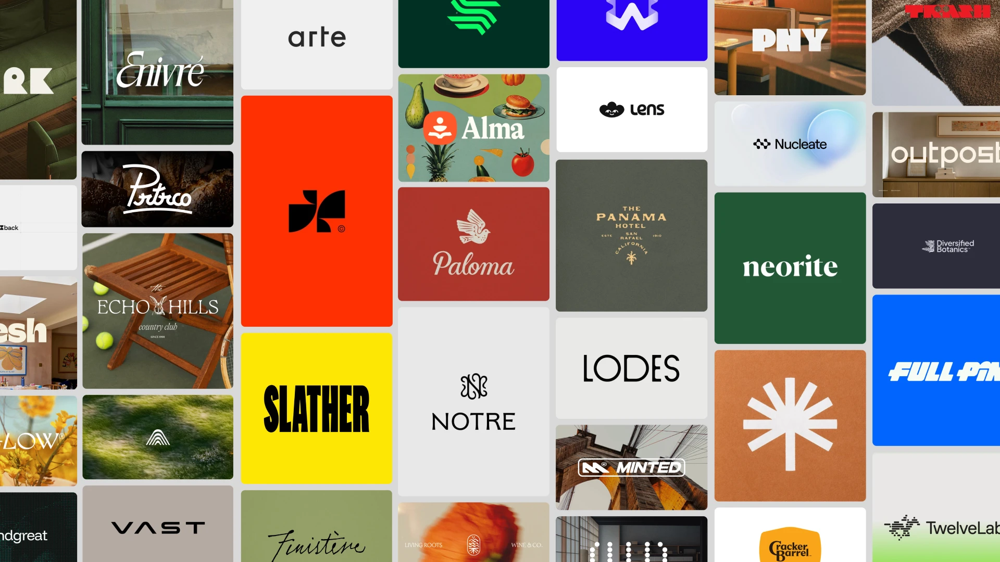

## Summary
The biggest logo design library for inspiration. Find inspiration by exploring over 1000 logos design on Logo System. From minimalist logo to wordmark, you

## Key Details
- **Source:** [logosystem.co](https://logosystem.co/)
- **Title:** Get inspiration by exploring a library of 1000+ logo designs on Logo System
- **Description:** The biggest logo design library for inspiration. Find inspiration by exploring over 1000 logos design on Logo System. From minimalist logo to wordmark

## Visual Assets

