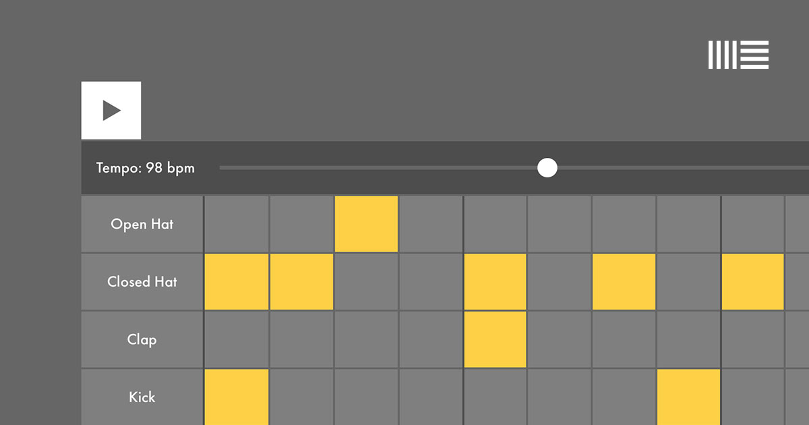

## Summary
Explore the fundamentals of music via Ableton

## Key Details
- **Source:** [learningmusic.ableton.com](https://learningmusic.ableton.com/index.html)
- **Title:** Get started | Learning Music
- **Description:** Explore the fundamentals of music via Ableton

## Visual Assets

