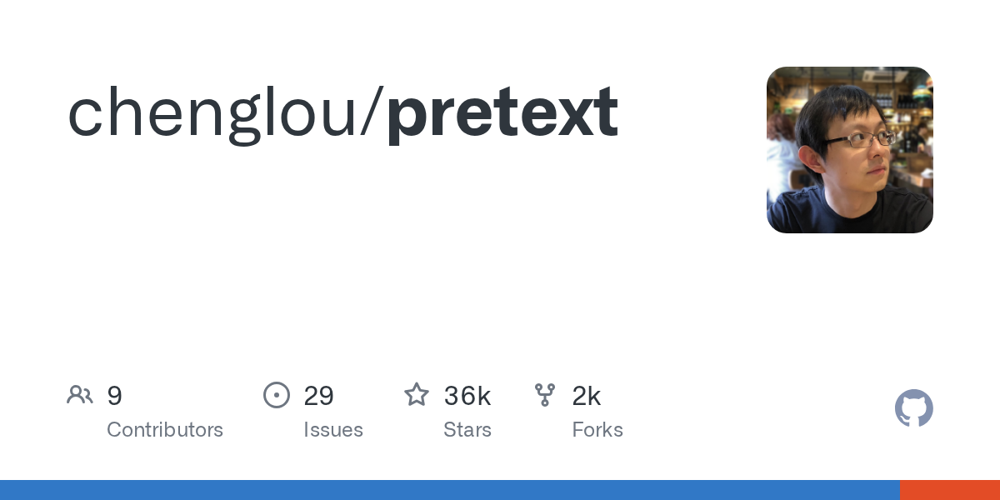

## Summary
Contribute to chenglou/pretext development by creating an account on GitHub.

## Key Details
- **Source:** [github.com](https://github.com/chenglou/pretext)
- **Title:** GitHub - chenglou/pretext
- **Description:** Contribute to chenglou/pretext development by creating an account on GitHub.

## Visual Assets

