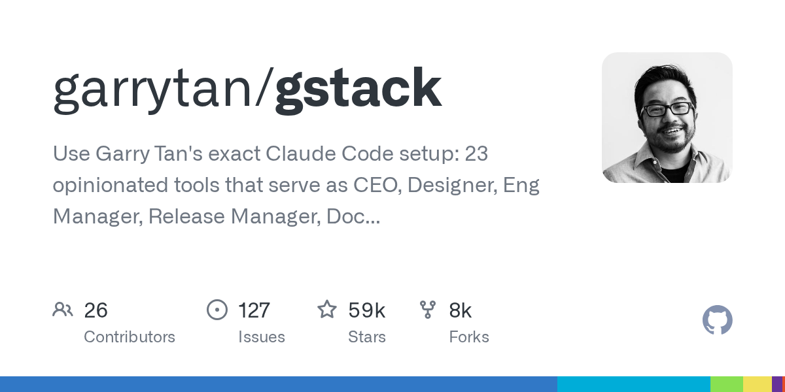

## Summary
Use Garry Tan's exact Claude Code setup: 23 opinionated tools that serve as CEO, Designer, Eng Manager, Release Manager, Doc Engineer, and QA - garrytan/gstack

## Key Details
- **Source:** [github.com](https://github.com/garrytan/gstack)
- **Title:** GitHub - garrytan/gstack: Use Garry Tan's exact Claude Code setup: 23 opinionated tools that serve as CEO, Designer, Eng Manager, Release Manager, Doc Engineer, and QA
- **Description:** Use Garry Tan's exact Claude Code setup: 23 opinionated tools that serve as CEO, Designer, Eng Manager, Release Manager, Doc Engineer, and QA - garryt

## Visual Assets

