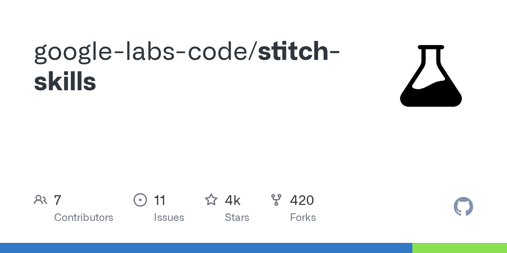

## Summary
Contribute to google-labs-code/stitch-skills development by creating an account on GitHub.

## Key Details
- **Source:** [github.com](https://github.com/google-labs-code/stitch-skills)
- **Title:** GitHub - google-labs-code/stitch-skills
- **Description:** Contribute to google-labs-code/stitch-skills development by creating an account on GitHub.

## Visual Assets

