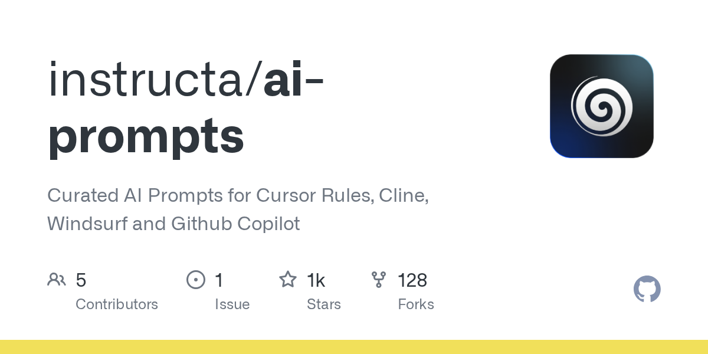

## Summary
Curated AI Prompts for Cursor Rules, Cline, Windsurf and Github Copilot - instructa/ai-prompts

## Key Details
- **Source:** [github.com](https://github.com/instructa/ai-prompts)
- **Title:** GitHub - instructa/ai-prompts: Curated AI Prompts for Cursor Rules, Cline, Windsurf and Github Copilot
- **Description:** Curated AI Prompts for Cursor Rules, Cline, Windsurf and Github Copilot - instructa/ai-prompts

## Visual Assets

