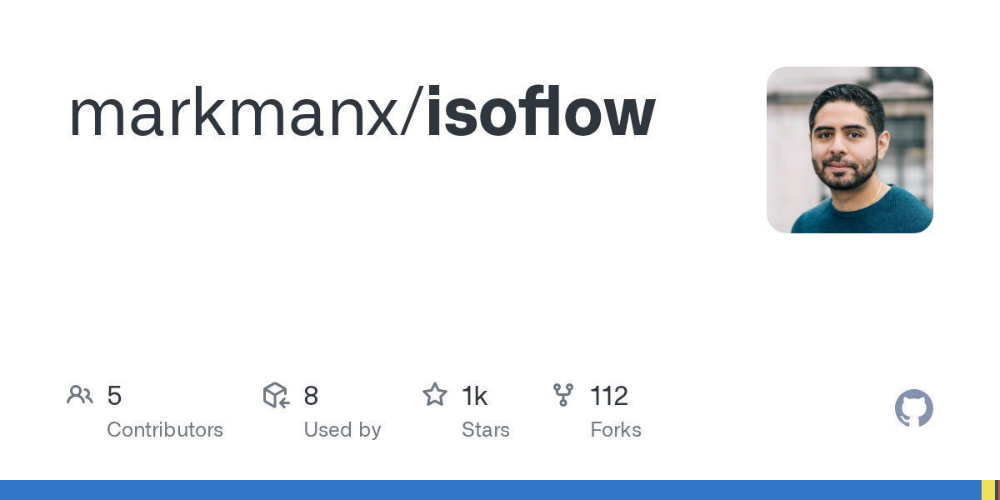

## Summary
Contribute to markmanx/isoflow development by creating an account on GitHub.

## Key Details
- **Source:** [github.com](https://github.com/markmanx/isoflow?tab=readme-ov-file)
- **Title:** GitHub - markmanx/isoflow
- **Description:** Contribute to markmanx/isoflow development by creating an account on GitHub.

## Visual Assets

