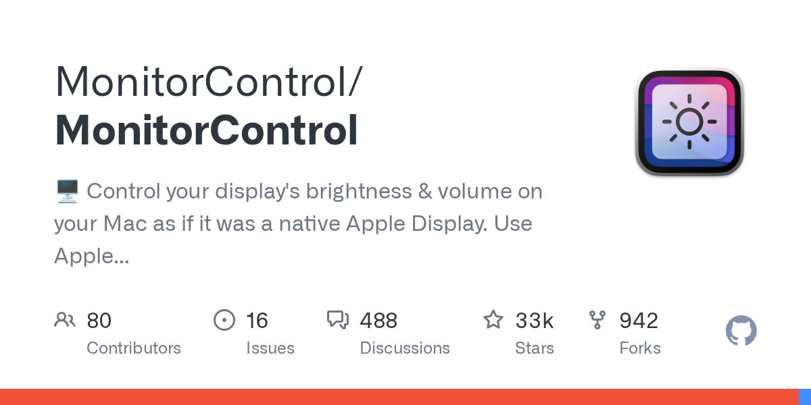

## Summary
🖥 Control your display&#39;s brightness &amp; volume on your Mac as if it was a native Apple Display. Use Apple Keyboard keys or custom shortcuts. Shows the native macOS OSDs. - MonitorControl/Moni...

## Key Details
- **Source:** [github.com](https://github.com/MonitorControl/MonitorControl)
- **Title:** GitHub - MonitorControl/MonitorControl: 🖥 Control your display's brightness & volume on your Mac as if it was a native Apple Display. Use Apple Keyboard keys or custom shortcuts. Shows the native macOS OSDs.
- **Description:** 🖥 Control your display&#39;s brightness &amp; volume on your Mac as if it was a native Apple Display. Use Apple Keyboard keys or custom shortcuts. Sho

## Visual Assets

