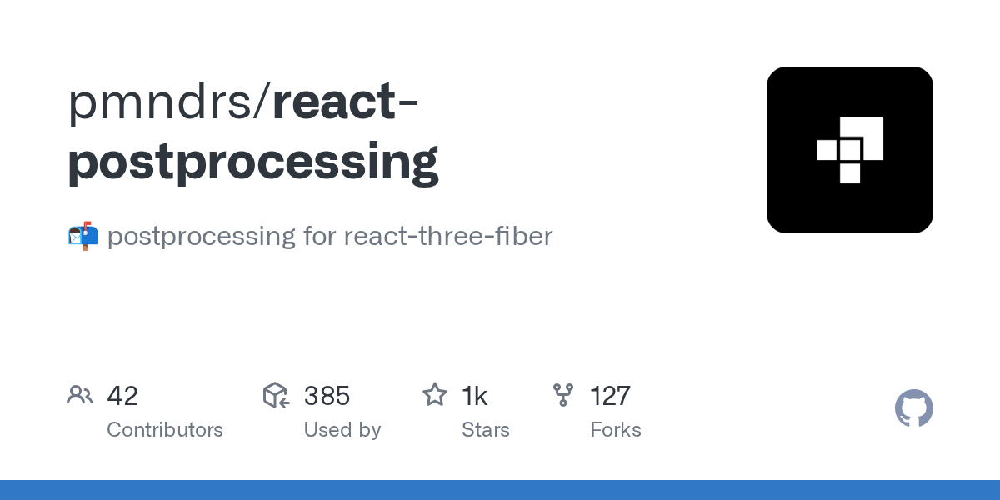

## Summary
📬  postprocessing for react-three-fiber. Contribute to pmndrs/react-postprocessing development by creating an account on GitHub.

## Key Details
- **Source:** [github.com](https://github.com/pmndrs/react-postprocessing)
- **Title:** GitHub - pmndrs/react-postprocessing: 📬  postprocessing for react-three-fiber
- **Description:** 📬  postprocessing for react-three-fiber. Contribute to pmndrs/react-postprocessing development by creating an account on GitHub.

## Visual Assets

