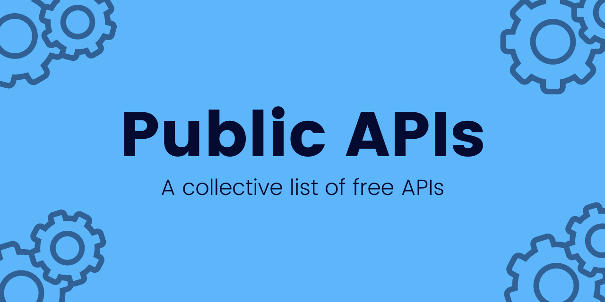

## Summary
A collective list of free APIs. Contribute to public-apis/public-apis development by creating an account on GitHub.

## Key Details
- **Source:** [github.com](https://github.com/public-apis/public-apis?tab=readme-ov-file)
- **Title:** GitHub - public-apis/public-apis: A collective list of free APIs
- **Description:** A collective list of free APIs. Contribute to public-apis/public-apis development by creating an account on GitHub.

## Visual Assets

