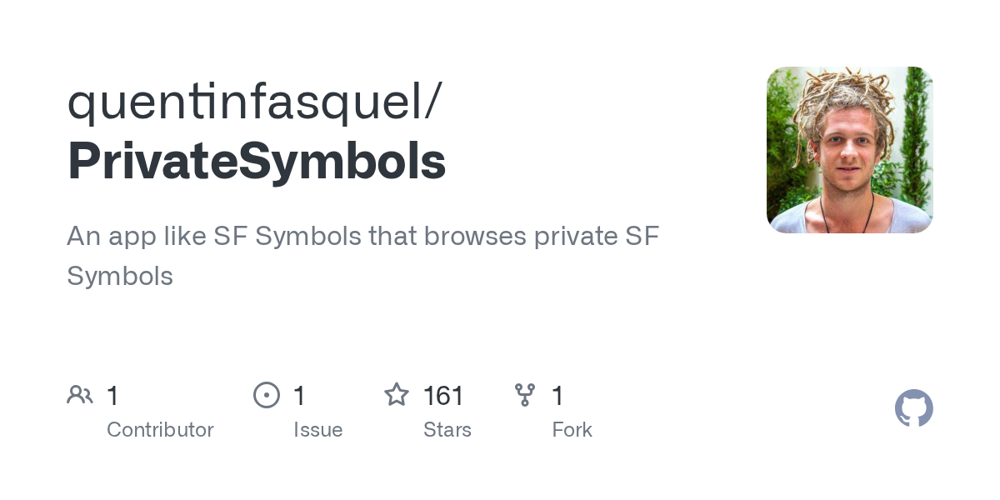

## Summary
An app like SF Symbols that browses private SF Symbols - quentinfasquel/PrivateSymbols

## Key Details
- **Source:** [github.com](https://github.com/quentinfasquel/PrivateSymbols)
- **Title:** GitHub - quentinfasquel/PrivateSymbols: An app like SF Symbols that browses private SF Symbols
- **Description:** An app like SF Symbols that browses private SF Symbols - quentinfasquel/PrivateSymbols

## Visual Assets

