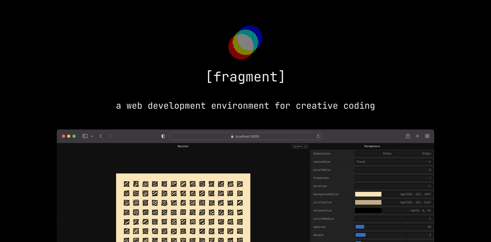

## Summary
[alpha] A web development environment for creative coding - raphaelameaume/fragment

## Key Details
- **Source:** [github.com](https://github.com/raphaelameaume/fragment)
- **Title:** GitHub - raphaelameaume/fragment: [alpha] A web development environment for creative coding
- **Description:** [alpha] A web development environment for creative coding - raphaelameaume/fragment

## Visual Assets

