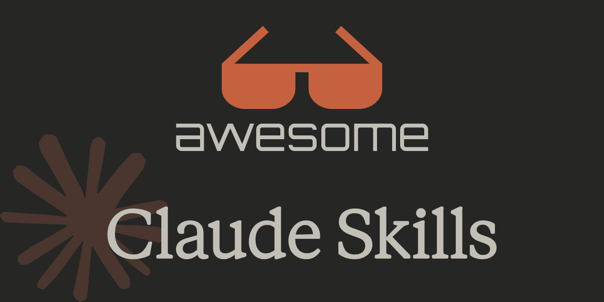

## Summary
A curated list of awesome Claude Skills, resources, and tools for customizing Claude AI workflows — particularly Claude Code - travisvn/awesome-claude-skills

## Key Details
- **Source:** [github.com](https://github.com/travisvn/awesome-claude-skills?tab=readme-ov-file)
- **Title:** GitHub - travisvn/awesome-claude-skills: A curated list of awesome Claude Skills, resources, and tools for customizing Claude AI workflows — particularly Claude Code
- **Description:** A curated list of awesome Claude Skills, resources, and tools for customizing Claude AI workflows — particularly Claude Code - travisvn/awesome-claude

## Visual Assets

