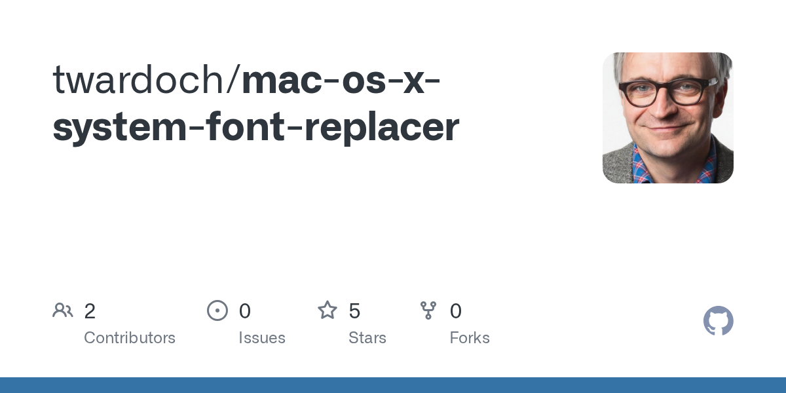

## Summary
Contribute to twardoch/mac-os-x-system-font-replacer development by creating an account on GitHub.

## Key Details
- **Source:** [github.com](https://github.com/twardoch/mac-os-x-system-font-replacer)
- **Title:** GitHub - twardoch/mac-os-x-system-font-replacer
- **Description:** Contribute to twardoch/mac-os-x-system-font-replacer development by creating an account on GitHub.

## Visual Assets

