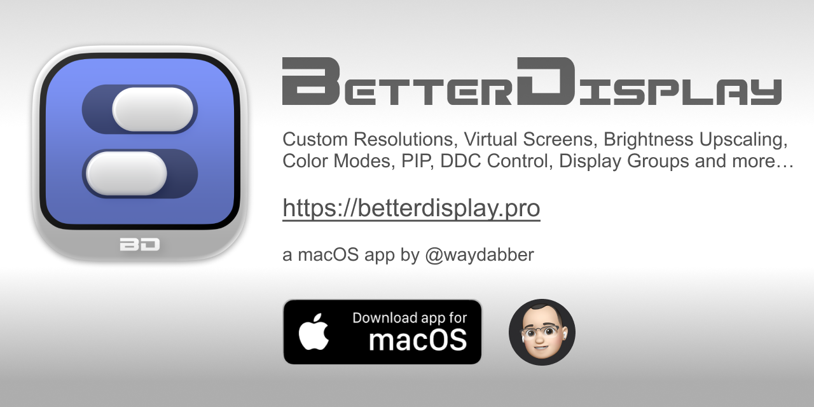

## Summary
Unlock your displays on your Mac! Flexible HiDPI scaling, XDR/HDR extra brightness, virtual screens, DDC control, extra dimming, PIP/streaming, EDID override and lots more! - waydabber/BetterDisplay

## Key Details
- **Source:** [github.com](https://github.com/waydabber/BetterDisplay)
- **Title:** GitHub - waydabber/BetterDisplay: Unlock your displays on your Mac! Flexible HiDPI scaling, XDR/HDR extra brightness, virtual screens, DDC control, extra dimming, PIP/streaming, EDID override and lots more!
- **Description:** Unlock your displays on your Mac! Flexible HiDPI scaling, XDR/HDR extra brightness, virtual screens, DDC control, extra dimming, PIP/streaming, EDID o

## Visual Assets

