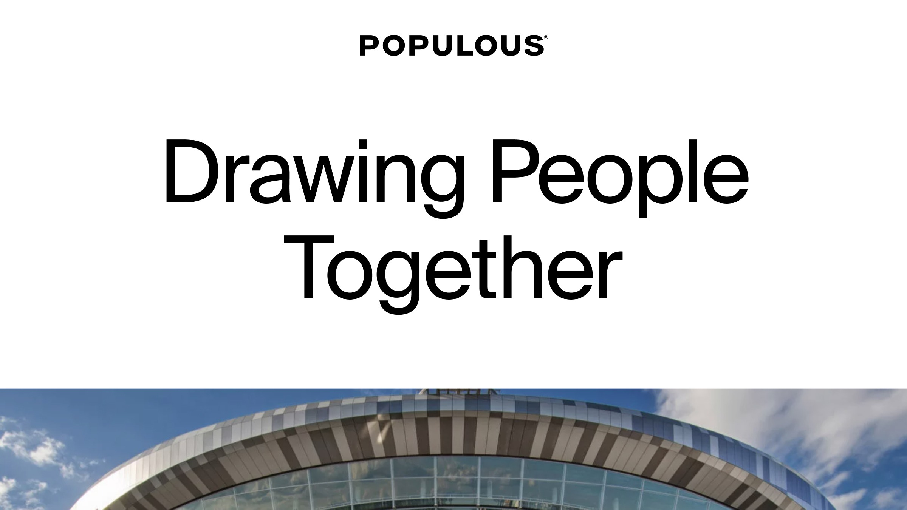

## Summary
Populous is a global architectural design firm specializing in creating environments & venues that draw communities and people together.

## Key Details
- **Source:** [populous.com](https://populous.com/)
- **Title:** Global Architectural Design – Stadiums, Arenas, Events | Populous
- **Description:** Populous is a global architectural design firm specializing in creating environments & venues that draw communities and people together.

## Visual Assets

