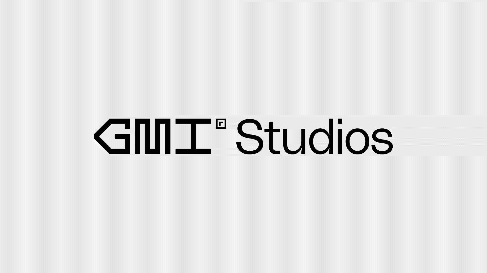

## Summary
Branding & design for a creative technology company putting possibilities in motion in the world of Web3 & NFTs.

## Key Details
- **Source:** [dennis.studio](https://dennis.studio/project/gmi-studios)
- **Title:** GMI Studios
- **Description:** Branding & design for a creative technology company putting possibilities in motion in the world of Web3 & NFTs.

## Visual Assets

