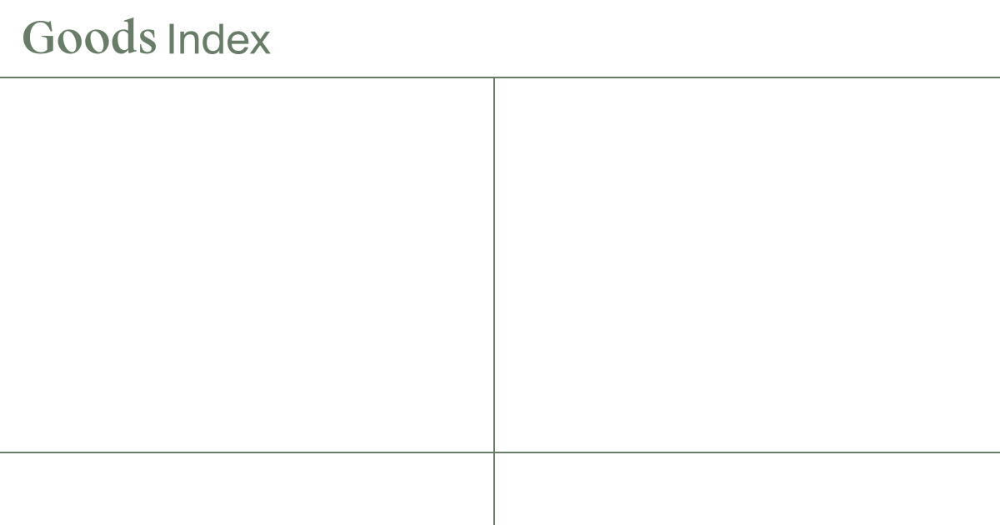

## Summary
Goods Index is a resource for supporting future-proof circular packaging

## Key Details
- **Source:** [index.goods.no](https://index.goods.no/)
- **Title:** Goods Index
- **Description:** Goods Index is a resource for supporting future-proof circular packaging

## Visual Assets

