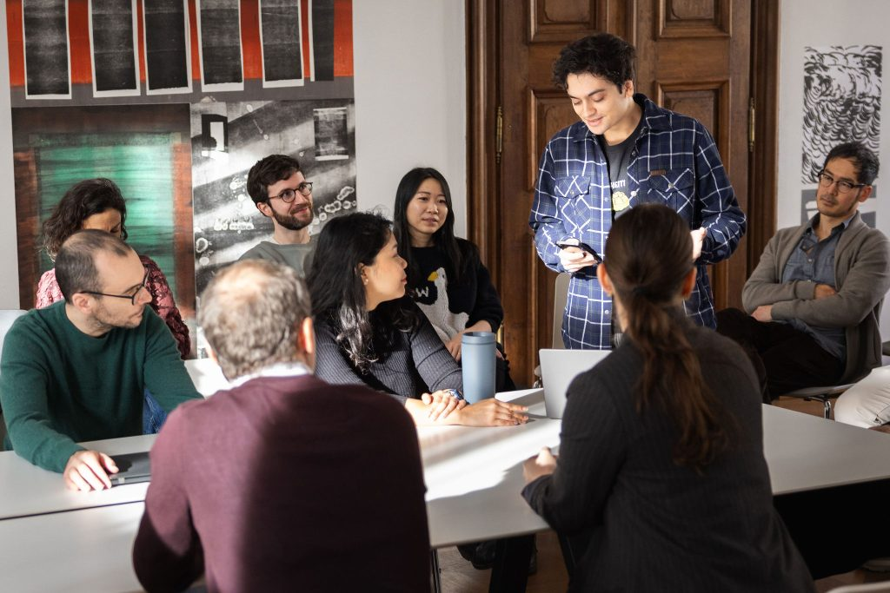

## Summary
Courses are offered both by CSH and by our partner universities, one of which will serve as the degree-granting entity. Students will be guided to the

## Key Details
- **Source:** [csh.ac.at](https://csh.ac.at/education/graduate-program/)
- **Title:** Graduate Program * Complexity Science Hub
- **Description:** Courses are offered both by CSH and by our partner universities, one of which will serve as the degree-granting entity. Students will be guided to the

## Visual Assets

