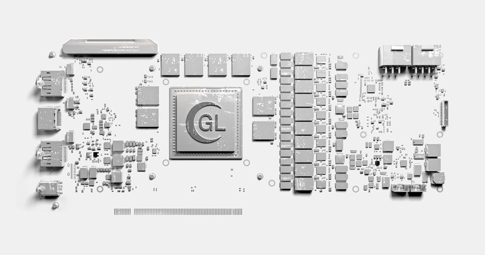

## Summary
A library of featured website inspiration specializing in 3D and 2D interactive experiences. This site archives how WebGL experiences are being explored as a tool for web design and digital interactio

## Key Details
- **Source:** [graphics-library.net](https://graphics-library.net/)
- **Title:** Graphics Library | 3D and Interactive Website Inspiration
- **Description:** A library of featured website inspiration specializing in 3D and 2D interactive experiences. This site archives how WebGL experiences are being explor

## Visual Assets

