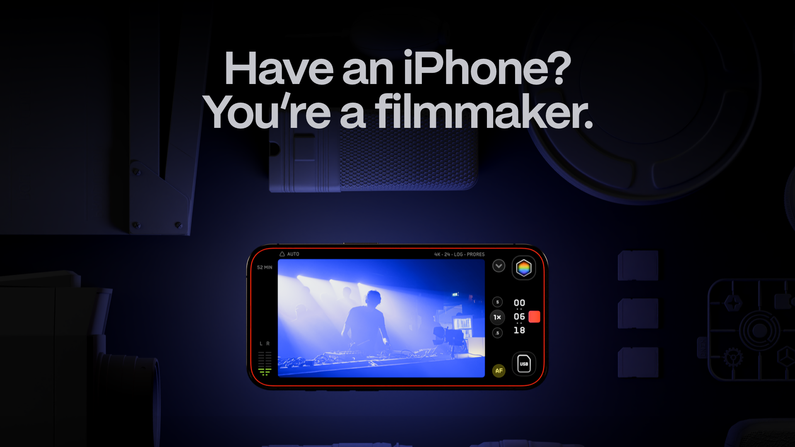

## Summary
Great, cinematic video made easy. Great with Apple Log. Packed with presets and LUT support and real pro tools.

## Key Details
- **Source:** [shotwithkino.com](https://www.shotwithkino.com/)
- **Title:** Great, cinematic video made easy. Great with Apple Log. Packed with presets and LUT support and real pro tools.
- **Description:** Great, cinematic video made easy. Great with Apple Log. Packed with presets and LUT support and real pro tools.

## Visual Assets

