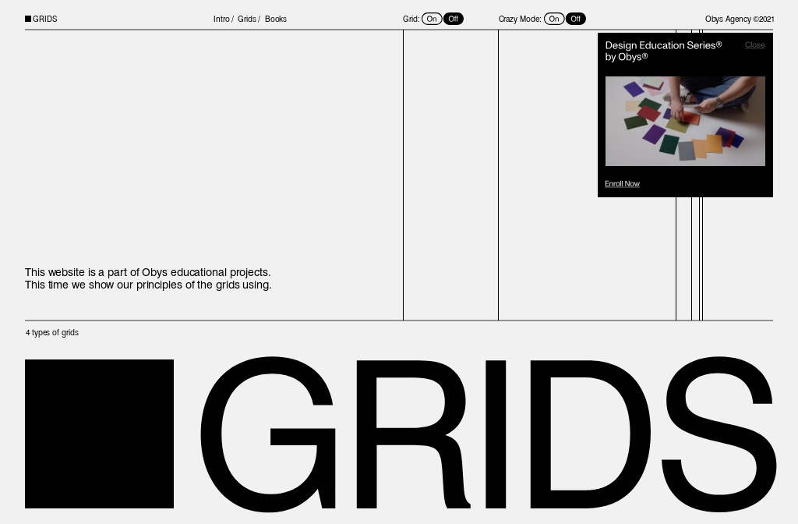

## Summary
The educational project about grids which Obys uses every day with unusual storytelling.

## Key Details
- **Source:** [grids.obys.agency](https://grids.obys.agency/)
- **Title:** Grids
- **Description:** The educational project about grids which Obys uses every day with unusual storytelling.

## Visual Assets

