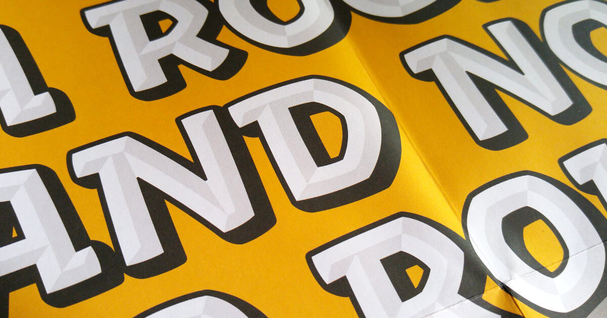

## Summary
Harbor Type is an independent type foundry based in the city of Porto Alegre, Brazil. Publisher of Garibaldi, Graviola, Rocher, Malva, Kiperman and more.

## Key Details
- **Source:** [harbortype.com](https://www.harbortype.com/)
- **Title:** Harbor Type | Fonts made in Brazil
- **Description:** Harbor Type is an independent type foundry based in the city of Porto Alegre, Brazil. Publisher of Garibaldi, Graviola, Rocher, Malva, Kiperman and mo

## Visual Assets

