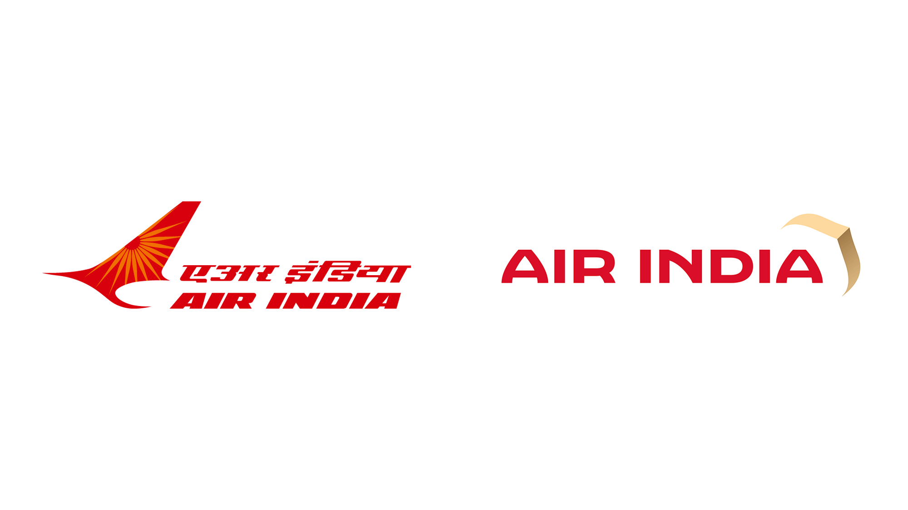

## Summary
New Logo, Identity, and Livery for Air India by Futurebrand

## Key Details
- **Source:** [underconsideration.com](https://www.underconsideration.com/brandnew/archives/new_logo_identity_and_livery_for_air_india_by_futurebrand.php)
- **Title:** Hasta La Vista
- **Description:** New Logo, Identity, and Livery for Air India by Futurebrand

## Visual Assets

