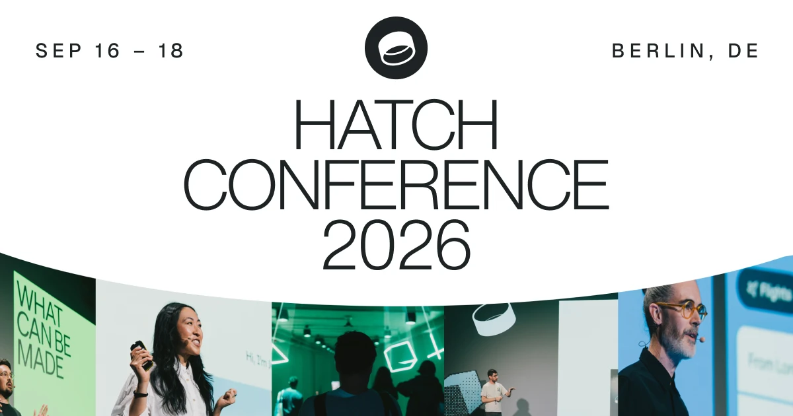

## Summary
Join the event for experienced product designers and researchers. 3 days of workshops, talks, and high-caliber networking. September 16 – 18, join in Berlin or online.

## Key Details
- **Source:** [hatchconference.com](https://www.hatchconference.com/)
- **Title:** Hatch Conference 2026 • Europe
- **Description:** Join the event for experienced product designers and researchers. 3 days of workshops, talks, and high-caliber networking. September 16 – 18, join in 

## Visual Assets

