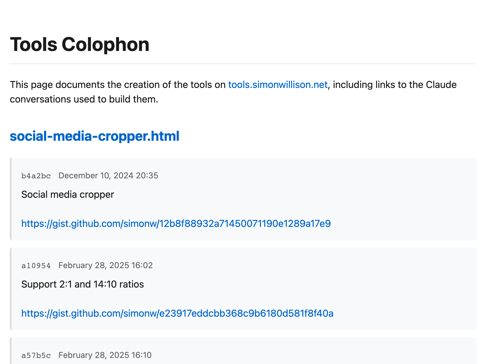

## Summary
Online discussions about using Large Language Models to help write code inevitably produce comments from developers who’s experiences have been disappointing. They often ask what they’re doing wrong—h

## Key Details
- **Source:** [simonwillison.net](https://simonwillison.net/2025/Mar/11/using-llms-for-code/)
- **Title:** Here’s how I use LLMs to help me write code
- **Description:** Online discussions about using Large Language Models to help write code inevitably produce comments from developers who’s experiences have been disapp

## Visual Assets

