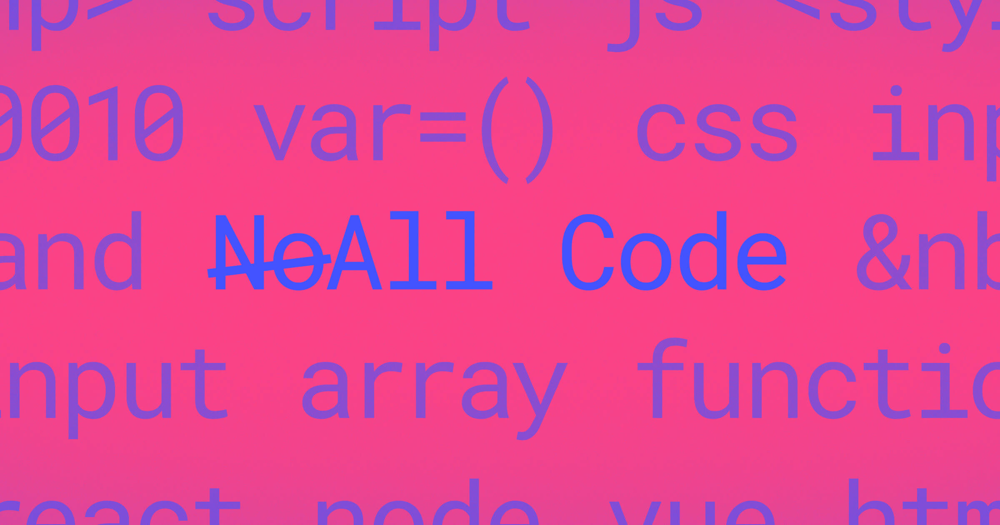

## Summary
Here's why coders should take a second look at "no-code" tools.

## Key Details
- **Source:** [webflow.com](https://webflow.com/blog/no-code-is-a-lie?utm_source=iterable&utm_medium=email)
- **Title:** Here's why coders should take a second look at "no-code" tools.
- **Description:** Here's why coders should take a second look at "no-code" tools.

## Visual Assets

