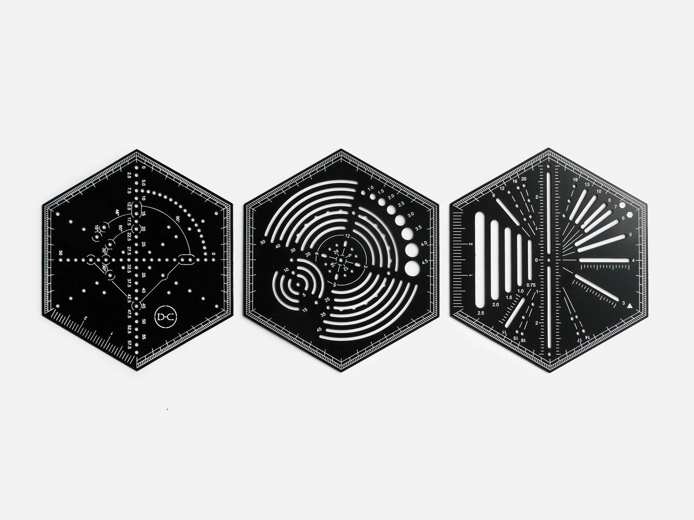

## Summary
Unique laser etched steel rulers, designed to assist in all manner of drawing techniques.  Point (left) acts as a compass, ruler &amp; Spirograph style pattern maker. Curve (centre) is a protractor an

## Key Details
- **Source:** [presentandcorrect.com](https://www.presentandcorrect.com/products/hexagon-ruler)
- **Title:** Hexagon Ruler
- **Description:** Unique laser etched steel rulers, designed to assist in all manner of drawing techniques.  Point (left) acts as a compass, ruler &amp; Spirograph styl

## Visual Assets

