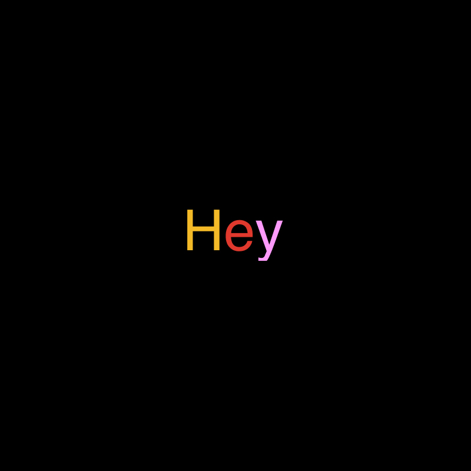

## Summary
Hey is a Barcelona-based creative studio founded in 2007. We specialize in developing creative strategies and visual languages for clients around the world 🌍. Our collaborative approach and passionate

## Key Details
- **Source:** [heystudio.es](https://heystudio.es/)
- **Title:** Hey
- **Description:** Hey is a Barcelona-based creative studio founded in 2007. We specialize in developing creative strategies and visual languages for clients around the 

## Visual Assets

