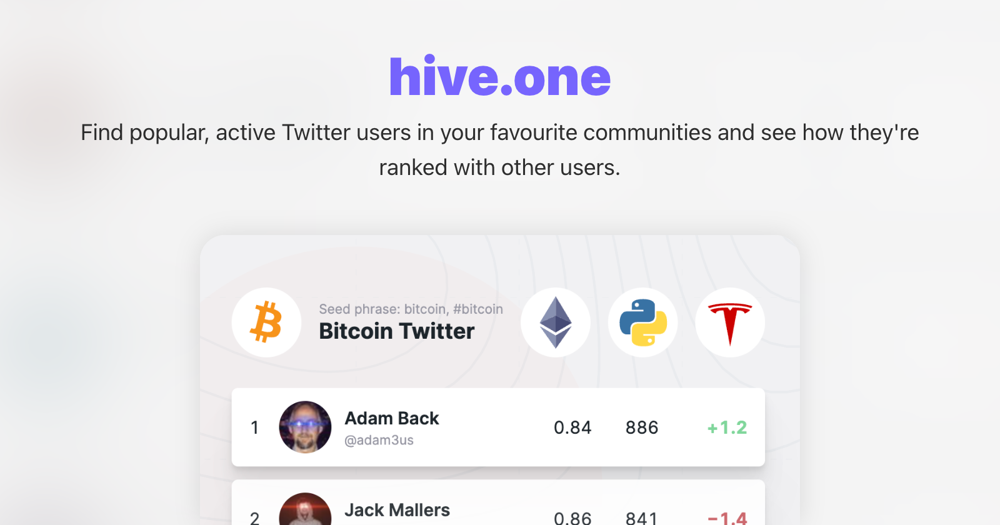

## Summary
Finding the right people to follow on Twitter can be tricky. Our algorithm tracks Twitter communities and who they pay attention to – creating intuitive ranked lists to help you choose who to follow

## Key Details
- **Source:** [hive.one](https://hive.one/)
- **Title:** hive.one – a new way to find reputable Twitter accounts
- **Description:** Finding the right people to follow on Twitter can be tricky. Our algorithm tracks Twitter communities and who they pay attention to – creating intuiti

## Visual Assets

