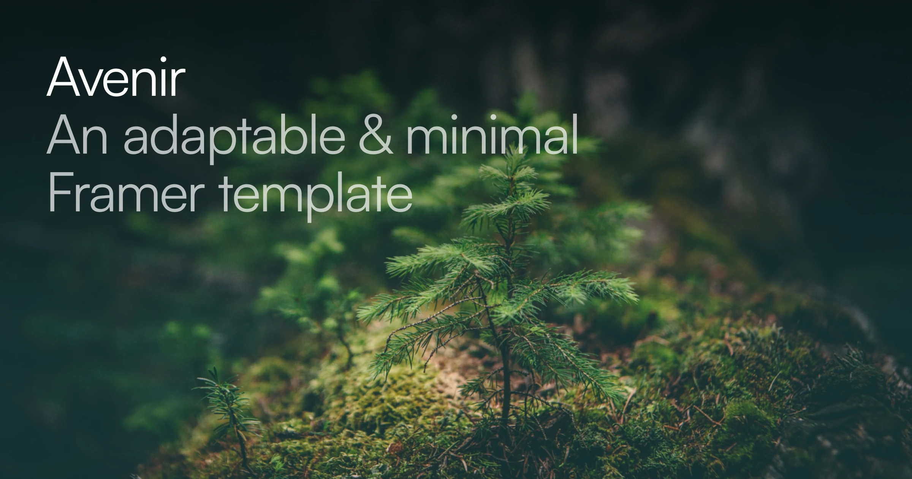

## Summary
Avenir is a highly adaptable minimalist Framer template designed to cater to diverse industry needs. Crafted by Vaibhav Khulbe.

## Key Details
- **Source:** [avenir.framer.website](https://avenir.framer.website/)
- **Title:** Home | Avenir — An adaptable & minimal Framer template
- **Description:** Avenir is a highly adaptable minimalist Framer template designed to cater to diverse industry needs. Crafted by Vaibhav Khulbe.

## Visual Assets

