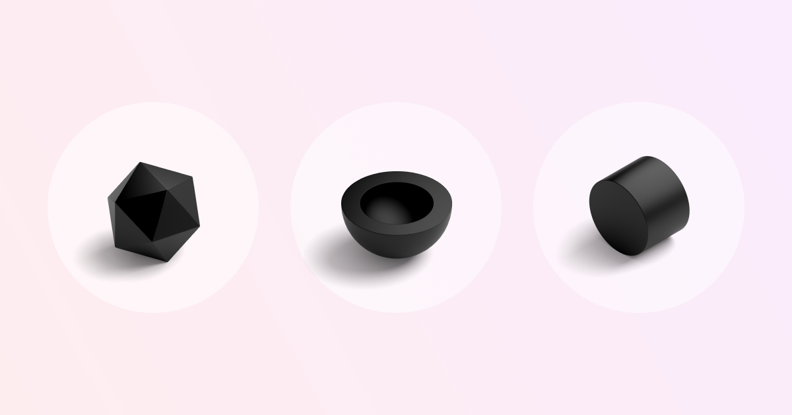

## Summary
Design guidelines following good practices that you can apply to product design, from components to design systems.

## Key Details
- **Source:** [goodpractices.design](https://goodpractices.design/)
- **Title:** Home
- **Description:** Design guidelines following good practices that you can apply to product design, from components to design systems.

## Visual Assets

