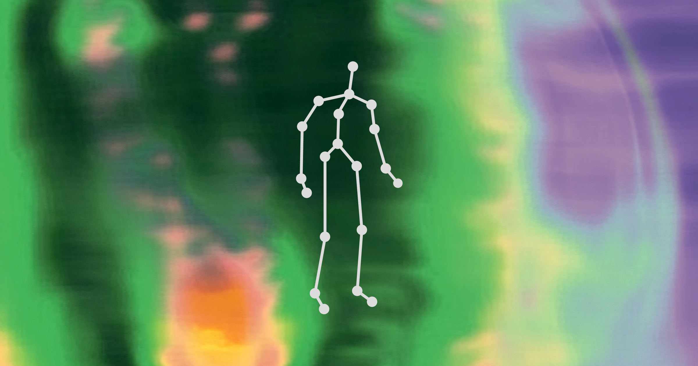

## Summary
Gentle Systems is a creative engineering studio based in Berlin. From vision to exploratory technology and experiences, our place between disciplines helps us serve clients looking not only for unique

## Key Details
- **Source:** [gentle.systems](https://www.gentle.systems/)
- **Title:** Home | Gentle Systems
- **Description:** Gentle Systems is a creative engineering studio based in Berlin. From vision to exploratory technology and experiences, our place between disciplines 

## Visual Assets

