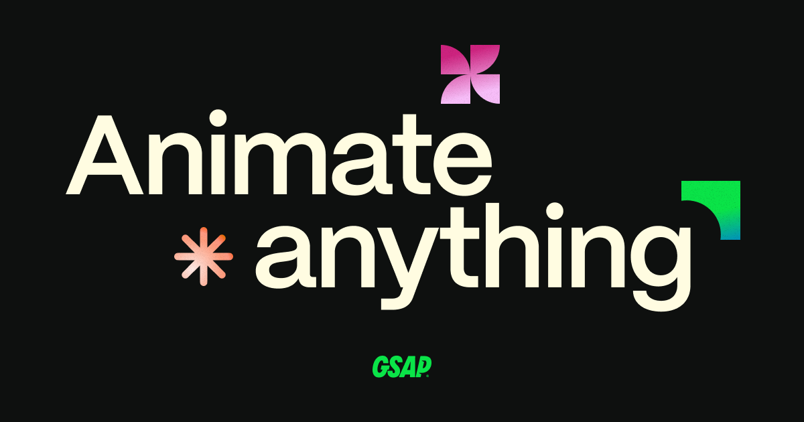

## Summary
Supported by Webflow. Animate Anything - A wildly robust JavaScript animation library built for professionals.

## Key Details
- **Source:** [gsap.com](https://gsap.com/)
- **Title:** Homepage
- **Description:** Supported by Webflow. Animate Anything - A wildly robust JavaScript animation library built for professionals.

## Visual Assets

