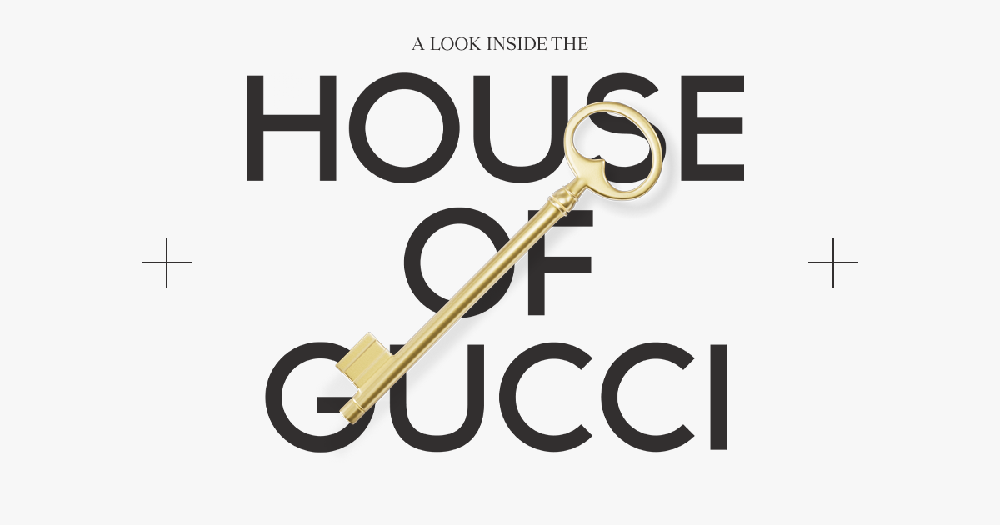

## Summary
Explore behind-the-scenes photographs and interviews detailing the making of Ridley Scott

## Key Details
- **Source:** [houseofgucci.aristidebenoist.com](https://houseofgucci.aristidebenoist.com/)
- **Title:** House of Gucci — An Inside Look
- **Description:** Explore behind-the-scenes photographs and interviews detailing the making of Ridley Scott

## Visual Assets

